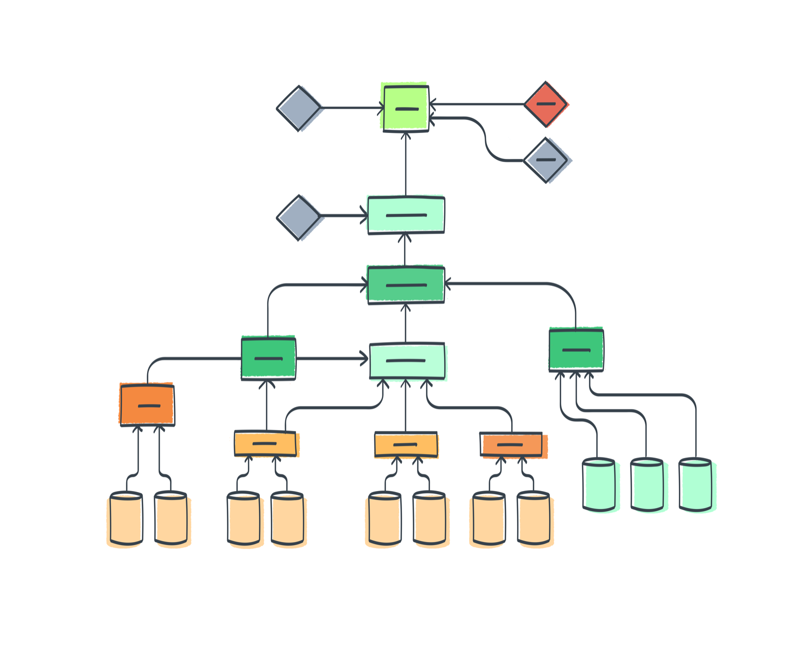

# About the Trustworthy and Ethical Assurance Platform

The Trustworthy and Ethical Assurance platform, or Assurance Platform for short,
is an open-source tool that has been designed and developed by researchers at
the Alan Turing Insitute and University of York to support the process of
developing and communicating assurance cases.

!!! question "What is an assurance case?"

    Historically, an assurance case is a formal method of documentation, commonly used in safety-critical systems, which presents an argument that a system satisfies particular safety, security, or reliability requirements (i.e. a goal). Assurance cases have been widely used in industries like energy, aviation, automotive, and more recently, healthcare, where the failure of a system to operate as expected can lead to significant consequences, including loss of life.

    An assurance case typically includes the following components:

      - Claims: These are the specific safety, security, or reliability goals that the system is supposed to meet.
      - Evidence: This is the data used to support the claims. Evidence could include test results, design analysis, past performance data, code reviews, and other relevant information.
      - Argument: This links the claims and the evidence together. It provides a logical reasoning showing how the evidence supports the claims.

The whole purpose of an assurance case is to provide confidence and demonstrate
to stakeholders, including regulators and customers, that a system is acceptably
safe or secure for its intended use. As such, the structrue of an assurance case
is important, and it should be developed in such a way that facilitates
communication and review by stakehodlers or third parties. For instance, using
clear and accessible terminology to assist those who need to understand and
evaluate the assurance argument. To support this structured, assurance cases are
often organized into a modular, hierarchical structure (e.g higher-level claims
supported by lower-level sub-claims), and standardised approaches, such as Goal
Structuring Notation (GSN), exist to allow complex arguments to be broken down
and understood more easily.

## Our Platform

The Trustworthy and Ethical Assurance Platform has been designed and developed
to support the process of developing assurance cases, making it easier for
stakeholders to meaningfully engage with the assurance process.
